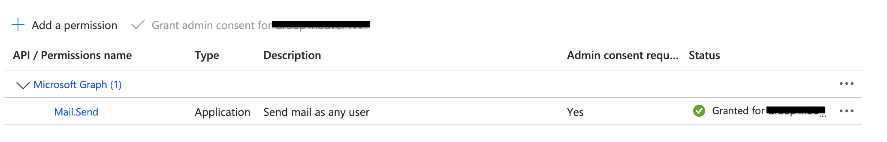

When using a **service principal** to create and manage Microsoft Fabric items, that service principal becomes the **owner** of those items. While this works well for most scenarios, it introduces a limitation when working with **Fabric Pipelines** that use the **Outlook** or **Teams** activities.

## The problem

The Outlook and Teams activities in Fabric pipelines rely on an **Office 365 connection**. These connections:

- Must be owned by a **real user**
- **Cannot** be owned by a service principal
- **Cannot** be shared with other users or identities

As a result, when a pipeline is owned by a service principal, there is currently **no out-of-the-box solution** to use these activities for notifications.

At the time of writing, there also does not seem to be a supported workaround for this limitation (that I could find).

## The workaround: Microsoft Graph API

Instead of relying on the built-in Outlook or Teams activities, you can send notifications by calling the **Microsoft Graph API directly**.

Using this approach:
- The service principal authenticates against **Microsoft Graph**
- The e-mail is sent on behalf of **an existing Entra ID user**
- The code can run in a **Fabric notebook** (or, for example, an Azure Function App)

Below is a complete example:

### Prerequisites

#### Microsoft Entra ID

1. The service principal must have the following **application permission**:
	- `Mail.Send`
2. **Admin consent** must be granted for this permission.

 

#### Service user (optional)

I created a dedicated **service user** that acts as the sender of the e-mails.
This avoids using a real person’s mailbox while still complying with Graph API requirements.

### Implementation

#### 1. Authenticate and get access token

First, we authenticate the service principal for the Microsoft Graph scope using the **msal** Python library and retrieve an access token. The service principal uses a client secret which is stored in an Azure Key Vault.

```python
def get_access_token():
	client_secret = notebookutils.credentials.getSecret("key-vault-uri", "secret-name")
	authority = f"https://login.microsoftonline.com/{tenant_id}"
	
	app = msal.ConfidentialClientApplication(
		client_id,
		authority=authority,
		client_credential=client_secret,
	) 

	result = app.acquire_token_for_client(scopes["https://graph.microsoft.com/.default"])
	if "access_token" not in result:
		raise RuntimeError(f"Token error: {result}")

	token = result["access_token"]
	return token
```

#### 2. Build Graph API request

Next, we compose the HTTP request payload that will be sent to the Graph API. This contains the recepients of the e-mail and the mail content.

```python
access_token = get_token()

headers = {
	"Authorization": f"Bearer {access_token}",
	"Content-Type": "application/json",
}

body = {
	"message": {
	"subject": "Fabric pipeline notification",
	"body": {
		"contentType": "Text",
		"content": "Pipeline succeeded!"
	},
	"toRecipients": [
		{
			"emailAddress": {
			"address": "recipient1@email.com"
			}
		},
		{
			"emailAddress": {
				"address": "recipient2@email.com"
			}
		},
	]},
	"saveToSentItems": "false"
}
```

#### 3. Send mail using Graph API

Finally, we send the e-mail using the `/sendMail` endpoint.
The sender is the **service user** created earlier.

```python
sender_upn = f"svc_user_pipelinealerts_{env_name}@yourcompany.com"
url = f"https://graph.microsoft.com/v1.0/users/{sender_upn}/sendMail"

response = requests.post(url, headers=headers, json=body)
response.raise_for_status()
```

## Conclusion

While Fabric pipelines currently do not support sending notifications via Outlook or Teams when owned by a service principal, using the **Microsoft Graph API** provides a reliable and flexible alternative.

This approach:
- Works seamlessly with service principals
- Avoids user-owned Office 365 connections 
- Can be reused across notebooks, pipelines, or Azure Functions

Until Fabric offers native support for this scenario, this solution serves as a practical workaround.


Full code:

```python
import msal
import notebookutils
import requests

def get_access_token():
	client_secret = notebookutils.credentials.getSecret("key-vault-uri", "secret-name")
	authority = f"https://login.microsoftonline.com/{tenant_id}"
	
	app = msal.ConfidentialClientApplication(
		client_id,
		authority=authority,
		client_credential=client_secret,
	) 

	result = app.acquire_token_for_client(scopes["https://graph.microsoft.com/.default"])
	if "access_token" not in result:
		raise RuntimeError(f"Token error: {result}")

	token = result["access_token"]
	return token

access_token = get_token()

headers = {
	"Authorization": f"Bearer {access_token}",
	"Content-Type": "application/json",
}

body = {
	"message": {
	"subject": "Fabric pipeline notification",
	"body": {
		"contentType": "Text",
		"content": "Pipeline succeeded!"
	},
	"toRecipients": [
		{
			"emailAddress": {
			"address": "recipient1@email.com"
			}
		},
		{
			"emailAddress": {
				"address": "recipient2@email.com"
			}
		},
	]},
	"saveToSentItems": "false"
}

sender_upn = f"svc_user_pipelinealerts_{env_name}@yourcompany.com"
url = f"https://graph.microsoft.com/v1.0/users/{sender_upn}/sendMail"

response = requests.post(url, headers=headers, json=body)
response.raise_for_status()
```
